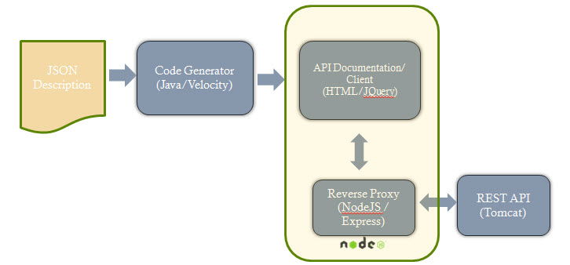

HTML/ JQuery API Doc and Code Generator
=======================================

The HTML/ JQuery API doc and code generator auto-generates HTML code augmented with JQuery code to allow users to view API documentation in a clear HTML format and directly interact with the API invoking the various operations that it supports. The only input required is the JSON based API description as described earlier. The tool includes 3 different parts:

* An html UI generator coded with JAVA
* A JQuery client who is able to get the posted user information from the UI, recognize the operation it belongs to and send it to the proxy server
* A proxy server builded with NodeJS that forwards the above request to the server that hosts the API

The html UI generator will output an index.html file that contains all the documentation. All the elements and placeholders are structured and named in such away that each HTTP request can be uniquely identified by the JQuery client. The JQuery client reads this information and makes an asynchronous call to the NodeJS server, who in turn also makes an asynchronous HTTP request to the API server. When the necessary information is returned the NodeJS server pushes the information back to the JQuery client that finally injects it on the appropriate fields of the user interface.

System Architecture
--------------------

	HTML/ JQuery doc and code generator architecture

In the above architecture we see that having as our only input the API description in JSON format, we generate HTML/ JQuery code all included in a single (index.html) file. NodeJS acts both as a server for our application and as a reverse proxy that forwards the user requests to the actual API server. We should mention here that because of the same origin security policy we cannot directly invoke our API methods using ajax through our user interface, but we should first send the request to an other app hosted on the NodeJS server that acts as a reverse proxy. The proxy will form an HTTP request and make an asynchronous call to the API and when it gets the answer it will push it back to the user interface and JQuery will finally inject the response to the HTML code.

Using the Doc Generator
-----------------------

To run the code you need to be on the java-lib directory and type the following command that runs the code and takes as an input argument the starbucks.json API description. ::

   ~/rest-coder/java-lib$ ./jsgen.sh ../java-src/input/starbucks.json

and the expected output after you run this command should be: ::

   Code successfully generated!

Of course if you prefer you can setup the code in Eclipse or the IDE of your preference and run this code by specifying the necessary argument through the project properties.

Generated Code
---------------

Running the above script will place the generated index.html file directly to the directory from witch NodeJS reverse-proxy server reads (ie: api-proxy/public/ directory).

This directory contains all the necessary filesd (CSS, Javascript etc) that our NodeJS server needs to serve the user interface. NodeJS serves our html code by reading from those directories. So it is important to maintain the same structure.

Setting up NodeJS/ Express
--------------------------

To use the generated code you have to first install NodeJS which is the technology we used to build our reverse proxy server, required to overcome the same origin security policy constraint that doesn't allow us to directly send our requests from the user interface to the API server.

In order to install NodeJS and the requirements for this particular application you have to do the following: ::

   Install nodejs: http://howtonode.org/how-to-install-nodejs

   Install npm: http://howtonode.org/introduction-to-npm

   npm install request

   npm install jquery

   npm install jsdom

   npm install connect

   npm install express

   npm install consolidate

Then you are ready to start the app. Go to the api-proxy/ directory and type: ::

	node app.js

If everything was installed correctly you should get the following message on your console ::

	Express server listening on port 3000

Using the tool
---------------

After completing the step above all you have to do is to open a browser and use http://localhost:3000/index.html as the address.

You should be able to see the resources of the starbucks API, and be able to expand them in order to see the different operations they support.
By submitting the required input you should be able to get back the response sent by the server, acompanied with the corresponding success or failure code and the response headers.

